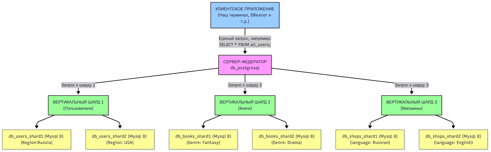
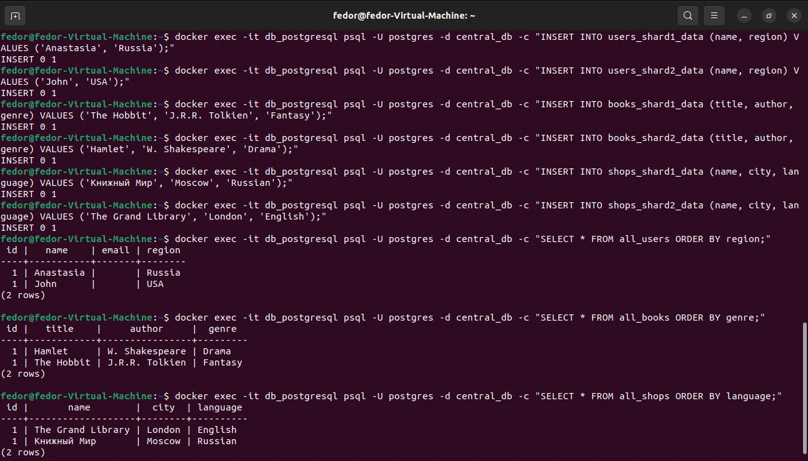

# Домашнее задание к занятию «Репликация и масштабирование. Часть 2» - Лунев Федор Владимирович

---

### Задание 1

Опишите основные преимущества использования масштабирования методами:

- активный master-сервер и пассивный репликационный slave-сервер; 
- master-сервер и несколько slave-серверов;


*Дайте ответ в свободной форме.*

---

1. Активный master и пассивный slave (1 Master - 1 Slave)

Основная цель - отказоустойчивость и сохранность данных.

Высокая доступность: При сбое master-сервера, slave-сервер становится новым мастером, что минимизирует время простоя системы.

Надежность: Slave является актуальной "живой" резервной копией, защищающей от потери данных при катастрофе на основном сервере.

Разгрузка мастера: Ресурсоемкие операции (бэкапы, аналитика) можно выполнять на slave, не затрагивая производительность master-сервера.

2. Master и несколько slave-серверов (1 Master - N Slaves)

Основная цель - масштабирование производительности для систем с большим количеством операций чтения.

Распределение нагрузки на чтение: Запросы на запись обрабатывает единственный master, а многочисленные запросы на чтение распределяются между несколькими slave-серверами, что многократно повышает общую производительность.

Снижение задержек: Реплики можно разместить географически ближе к пользователям, ускоряя для них доступ к данным.

Изоляция нагрузки: Разные slave-servеры можно выделить под разные типы задач (например, одни для сайта, другие — для аналитических отчетов), чтобы они не мешали друг другу.

### Задание 2


Разработайте план для выполнения горизонтального и вертикального шаринга базы данных. База данных состоит из трёх таблиц: 

- пользователи, 
- книги, 
- магазины (столбцы произвольно). 

Опишите принципы построения системы и их разграничение или разбивку между базами данных.

*Пришлите блоксхему, где и что будет располагаться. Опишите, в каких режимах будут работать сервера.* 

---

Блок схема




Принципы построения системы

Для решения задачи использована гибридная архитектура с вертикальным и горизонтальным шардированием и центральным сервером-федератором для унифицированного доступа к данным.

Вертикальный шардинг:

Данные разделены по бизнес-сущностям:

Шард Пользователей: db_users_shard1 и db_users_shard2 хранят данные о пользователях.

Шард Книг: db_books_shard1 и db_books_shard2 содержат данные о книгах.

Шард Магазинов: db_shops_shard1 и db_shops_shard2 управляют данными о магазинах.

Горизонтальный шардинг:

Инфраструктура проекта позволяет применять горизонтальное шардирование ко всем бизнес-сущностям для распределения нагрузки и данных. В нашей архитектуре предполагается следующая логика разделения:

Пользователи: Распределяются по Региону (Region) между серверами db_users_shard1 и db_users_shard2.

Книги: Распределяются по Жанру (Genre) между серверами db_books_shard1 и db_books_shard2.

Магазины: Распределяются по Языку (Language) между серверами db_shops_shard1 и db_shops_shard2.

В реальной системе логика выбора конкретного шарда для записи на основе этих ключей реализуется на уровне приложения.

Федеративный сервер:

Для упрощения доступа к данным используется PostgreSQL с расширением mysql_fdw, который объединяет данные из всех MySQL-шардов и предоставляет их через единые представления (VIEWS), скрывая сложность распределенной архитектуры.

В данной архитектуре репликация не используется: каждый шард функционирует автономно и хранит только свою часть данных. Федератор объединяет все шарды в единое логическое пространство, обеспечивая прозрачный доступ для клиентских приложений. При необходимости масштабирования и повышения отказоустойчивости, поддержку репликации можно добавить на более поздних этапах.

### Задание 3*

Выполните настройку выбранных методов шардинга из задания 2.

*Пришлите конфиг Docker и SQL скрипт с командами для базы данных*.

---

```text
/replica2/
├── docker-compose.yml
├── config/
│   └── my.cnf
├── init/
│   ├── postgresql-init.sql
│   ├── schema_books.sql
│   ├── schema_shops.sql
│   └── schema_users.sql
└── postgresql/
    └── Dockerfile
```

docker-compose.yml
```yaml
services:
  db_postgresql:
    build: ./postgresql
    container_name: db_postgresql
    networks: [db_network]
    volumes:
      - db_postgresql_data:/var/lib/postgresql/data
      - ./init/postgresql-init.sql:/docker-entrypoint-initdb.d/init.sql
    ports: ["5432:5432"]
    environment: { POSTGRES_PASSWORD: root_password, POSTGRES_DB: central_db }
    healthcheck: { test: ["CMD-SHELL", "pg_isready -U postgres"], interval: 10s, timeout: 5s, retries: 5, start_period: 60s }
    restart: unless-stopped
    depends_on:
      db_users_shard1: { condition: service_healthy }
      db_users_shard2: { condition: service_healthy }
      db_books_shard1: { condition: service_healthy }
      db_books_shard2: { condition: service_healthy }
      db_shops_shard1: { condition: service_healthy }
      db_shops_shard2: { condition: service_healthy }

  db_users_shard1:
    image: mysql:8.0
    container_name: db_users_shard1
    networks: [db_network]
    volumes: ["./config/my.cnf:/etc/mysql/conf.d/my.cnf", "db_users_shard1_data:/var/lib/mysql", "./init/schema_users.sql:/docker-entrypoint-initdb.d/1_schema.sql"]
    ports: ["3306:3306"]
    environment: { MYSQL_ROOT_PASSWORD: root_password, MYSQL_DATABASE: users_db }
    healthcheck: { test: ["CMD-SHELL", "mysqladmin ping -h 127.0.0.1 --protocol=tcp -uroot -p$$MYSQL_ROOT_PASSWORD"], interval: 30s, timeout: 10s, retries: 20, start_period: 600s }
    restart: unless-stopped

  db_users_shard2:
    image: mysql:8.0
    container_name: db_users_shard2
    networks: [db_network]
    volumes: ["./config/my.cnf:/etc/mysql/conf.d/my.cnf", "db_users_shard2_data:/var/lib/mysql", "./init/schema_users.sql:/docker-entrypoint-initdb.d/1_schema.sql"]
    ports: ["3307:3306"]
    environment: { MYSQL_ROOT_PASSWORD: root_password, MYSQL_DATABASE: users_db }
    healthcheck: { test: ["CMD-SHELL", "mysqladmin ping -h 127.0.0.1 --protocol=tcp -uroot -p$$MYSQL_ROOT_PASSWORD"], interval: 30s, timeout: 10s, retries: 20, start_period: 600s }
    restart: unless-stopped

  db_books_shard1:
    image: mysql:8.0
    container_name: db_books_shard1
    networks: [db_network]
    volumes: ["./config/my.cnf:/etc/mysql/conf.d/my.cnf", "db_books_shard1_data:/var/lib/mysql", "./init/schema_books.sql:/docker-entrypoint-initdb.d/1_schema.sql"]
    ports: ["3308:3306"]
    environment: { MYSQL_ROOT_PASSWORD: root_password, MYSQL_DATABASE: books_db }
    healthcheck: { test: ["CMD-SHELL", "mysqladmin ping -h 127.0.0.1 --protocol=tcp -uroot -p$$MYSQL_ROOT_PASSWORD"], interval: 30s, timeout: 10s, retries: 20, start_period: 600s }
    restart: unless-stopped

  db_books_shard2:
    image: mysql:8.0
    container_name: db_books_shard2
    networks: [db_network]
    volumes: ["./config/my.cnf:/etc/mysql/conf.d/my.cnf", "db_books_shard2_data:/var/lib/mysql", "./init/schema_books.sql:/docker-entrypoint-initdb.d/1_schema.sql"]
    ports: ["3309:3306"]
    environment: { MYSQL_ROOT_PASSWORD: root_password, MYSQL_DATABASE: books_db }
    healthcheck: { test: ["CMD-SHELL", "mysqladmin ping -h 127.0.0.1 --protocol=tcp -uroot -p$$MYSQL_ROOT_PASSWORD"], interval: 30s, timeout: 10s, retries: 20, start_period: 600s }
    restart: unless-stopped

  db_shops_shard1:
    image: mysql:8.0
    container_name: db_shops_shard1
    networks: [db_network]
    volumes: ["./config/my.cnf:/etc/mysql/conf.d/my.cnf", "db_shops_shard1_data:/var/lib/mysql", "./init/schema_shops.sql:/docker-entrypoint-initdb.d/1_schema.sql"]
    ports: ["3310:3306"]
    environment: { MYSQL_ROOT_PASSWORD: root_password, MYSQL_DATABASE: shops_db }
    healthcheck: { test: ["CMD-SHELL", "mysqladmin ping -h 127.0.0.1 --protocol=tcp -uroot -p$$MYSQL_ROOT_PASSWORD"], interval: 30s, timeout: 10s, retries: 20, start_period: 600s }
    restart: unless-stopped

  db_shops_shard2:
    image: mysql:8.0
    container_name: db_shops_shard2
    networks: [db_network]
    volumes: ["./config/my.cnf:/etc/mysql/conf.d/my.cnf", "db_shops_shard2_data:/var/lib/mysql", "./init/schema_shops.sql:/docker-entrypoint-initdb.d/1_schema.sql"]
    ports: ["3311:3306"]
    environment: { MYSQL_ROOT_PASSWORD: root_password, MYSQL_DATABASE: shops_db }
    healthcheck: { test: ["CMD-SHELL", "mysqladmin ping -h 127.0.0.1 --protocol=tcp -uroot -p$$MYSQL_ROOT_PASSWORD"], interval: 30s, timeout: 10s, retries: 20, start_period: 600s }
    restart: unless-stopped

networks:
  db_network: { driver: bridge }

volumes:
  db_postgresql_data:
  db_users_shard1_data:
  db_users_shard2_data:
  db_books_shard1_data:
  db_books_shard2_data:
  db_shops_shard1_data:
  db_shops_shard2_data:
```

schema_users.sql
```sql
CREATE TABLE IF NOT EXISTS users (id INT AUTO_INCREMENT PRIMARY KEY, name VARCHAR(100), email VARCHAR(100), region VARCHAR(50));
```

schema_books.sql
```sql
CREATE TABLE IF NOT EXISTS books (id INT AUTO_INCREMENT PRIMARY KEY, title VARCHAR(255), author VARCHAR(255), genre VARCHAR(50));
```

schema_shops.sql
```sql
CREATE TABLE IF NOT EXISTS shops (id INT AUTO_INCREMENT PRIMARY KEY, name VARCHAR(100), city VARCHAR(100), language VARCHAR(50));
```

postgresql-init.sql
```sql
CREATE EXTENSION mysql_fdw;

CREATE SERVER users_shard1_server FOREIGN DATA WRAPPER mysql_fdw OPTIONS (host 'db_users_shard1', port '3306');
CREATE SERVER users_shard2_server FOREIGN DATA WRAPPER mysql_fdw OPTIONS (host 'db_users_shard2', port '3306');
CREATE SERVER books_shard1_server FOREIGN DATA WRAPPER mysql_fdw OPTIONS (host 'db_books_shard1', port '3306');
CREATE SERVER books_shard2_server FOREIGN DATA WRAPPER mysql_fdw OPTIONS (host 'db_books_shard2', port '3306');
CREATE SERVER shops_shard1_server FOREIGN DATA WRAPPER mysql_fdw OPTIONS (host 'db_shops_shard1', port '3306');
CREATE SERVER shops_shard2_server FOREIGN DATA WRAPPER mysql_fdw OPTIONS (host 'db_shops_shard2', port '3306');

CREATE USER MAPPING FOR postgres SERVER users_shard1_server OPTIONS (username 'root', password 'root_password');
CREATE USER MAPPING FOR postgres SERVER users_shard2_server OPTIONS (username 'root', password 'root_password');
CREATE USER MAPPING FOR postgres SERVER books_shard1_server OPTIONS (username 'root', password 'root_password');
CREATE USER MAPPING FOR postgres SERVER books_shard2_server OPTIONS (username 'root', password 'root_password');
CREATE USER MAPPING FOR postgres SERVER shops_shard1_server OPTIONS (username 'root', password 'root_password');
CREATE USER MAPPING FOR postgres SERVER shops_shard2_server OPTIONS (username 'root', password 'root_password');

CREATE FOREIGN TABLE users_shard1_data (id INT, name VARCHAR(100), email VARCHAR(100), region VARCHAR(50)) SERVER users_shard1_server OPTIONS (dbname 'users_db', table_name 'users');
CREATE FOREIGN TABLE users_shard2_data (id INT, name VARCHAR(100), email VARCHAR(100), region VARCHAR(50)) SERVER users_shard2_server OPTIONS (dbname 'users_db', table_name 'users');
CREATE FOREIGN TABLE books_shard1_data (id INT, title VARCHAR(255), author VARCHAR(255), genre VARCHAR(50)) SERVER books_shard1_server OPTIONS (dbname 'books_db', table_name 'books');
CREATE FOREIGN TABLE books_shard2_data (id INT, title VARCHAR(255), author VARCHAR(255), genre VARCHAR(50)) SERVER books_shard2_server OPTIONS (dbname 'books_db', table_name 'books');


CREATE FOREIGN TABLE shops_shard1_data (id INT, name VARCHAR(100), city VARCHAR(100), language VARCHAR(50)) SERVER shops_shard1_server OPTIONS (dbname 'shops_db', table_name 'shops');
CREATE FOREIGN TABLE shops_shard2_data (id INT, name VARCHAR(100), city VARCHAR(100), language VARCHAR(50)) SERVER shops_shard2_server OPTIONS (dbname 'shops_db', table_name 'shops');


CREATE VIEW all_users AS SELECT * FROM users_shard1_data UNION ALL SELECT * FROM users_shard2_data;
CREATE VIEW all_books AS SELECT * FROM books_shard1_data UNION ALL SELECT * FROM books_shard2_data;
CREATE VIEW all_shops AS SELECT * FROM shops_shard1_data UNION ALL SELECT * FROM shops_shard2_data;
```

Тестирование


